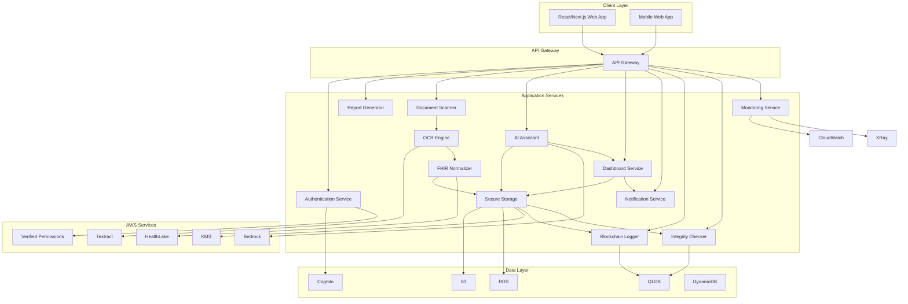

# Design Document: Medi-Vault Health Platform

## Overview

Medi-Vault is a secure personal health management platform that enables patients to digitize, store, and analyze their medical records. The system supports multiple workflows: patient self-scanning, doctor-created reports, pre-visit preparation, AI-powered insights, longitudinal tracking, and immutable audit trails. Built entirely on AWS services, Medi-Vault uses Amazon QLDB for blockchain-based audit logging, ensuring data integrity and compliance with HIPAA/GDPR requirements.

**Key Architectural Principles:**
- **Deterministic pipeline**: No agentic complexity; each component has clear responsibilities
- **Mobile-first**: Responsive design optimized for mobile devices
- **Security by design**: Encryption at rest and in transit, MFA enforcement, fine-grained access control
- **Immutable audit trail**: AWS QLDB for tamper-proof transaction history
- **Production-grade**: Scalable, observable, and compliant

## Architecture



## Components and Interfaces

### Core Services

#### Document Scanner
- **Purpose**: Capture and preprocess medical documents for OCR processing
- **Inputs**: Document files (PDF, images) up to 25MB
- **Outputs**: Preprocessed document, unique document identifier
- **Key Operations**:
  - File format validation
  - Size limit enforcement
  - Document preprocessing (rotation, cleanup)
  - Unique ID generation

#### OCR Engine
- **Purpose**: Extract text from documents using AWS Textract
- **Inputs**: Preprocessed document
- **Outputs**: Extracted text with positional information
- **Key Operations**:
  - Textract integration
  - Text extraction with structure preservation
  - Error handling with retry logic
  - Processing time monitoring

#### FHIR Normalizer
- **Purpose**: Convert extracted text to FHIR-aligned structured data
- **Inputs**: Extracted text from OCR
- **Outputs**: FHIR-aligned structured data with provenance
- **Key Operations**:
  - Medication extraction (names, dosages, frequencies)
  - Lab report extraction (test names, values, ranges)
  - Visit summary extraction (diagnoses, procedures)
  - Confidence scoring for uncertain extractions
  - Provenance tracking

#### Secure Storage
- **Purpose**: Store documents and structured data securely
- **Inputs**: Encrypted data, metadata
- **Outputs**: Storage confirmation with audit log
- **Key Operations**:
  - Per-user KMS encryption
  - S3 document storage with versioning
  - RDS structured data storage
  - Audit logging
  - Data deletion workflows

#### AI Assistant
- **Purpose**: Context-aware Q&A with controlled RAG pipeline
- **Inputs**: Patient question, medical context
- **Outputs**: Answer with confidence score and citations
- **Key Operations**:
  - Context retrieval from patient records
  - Bedrock integration for generative Q&A
  - Confidence scoring
  - Source citation
  - Guardrails for sensitive topics

#### Dashboard Service
- **Purpose**: Longitudinal analytics and trend visualization
- **Inputs**: Patient health data
- **Outputs**: Visualizations, clinician summaries
- **Key Operations**:
  - Longitudinal analytics
  - Vitals visualization (glucose, BP, weight)
  - Clinician summary generation
  - Time period comparisons
  - Mobile-optimized rendering

#### Report Generator
- **Purpose**: Create and send medical reports from doctors to patients
- **Inputs**: Clinical information, doctor credentials
- **Outputs**: FHIR-aligned report, patient notification
- **Key Operations**:
  - Structured form for clinical entry
  - FHIR format storage
  - Digital signature requirement
  - Patient notification
  - Automatic FHIR normalization

#### Notification Service
- **Purpose**: Handle in-app notifications
- **Inputs**: Notification events
- **Outputs**: In-app notifications
- **Key Operations**:
  - In-app notification delivery
  - Read status tracking
  - Chronological ordering
  - Notification retention

#### Blockchain Logger
- **Purpose**: Record critical operations to AWS QLDB
- **Inputs**: Operations data
- **Outputs**: Blockchain transaction receipt
- **Key Operations**:
  - Access event logging
  - Modification logging with cryptographic hash
  - Consent action logging
  - Document action logging
  - Cryptographic verification

#### Integrity Checker
- **Purpose**: Verify data integrity
- **Inputs**: Document data, stored hash
- **Outputs**: Integrity verification result
- **Key Operations**:
  - Hash generation for stored documents
  - Hash verification on retrieval
  - Integrity violation detection
  - Independent verification support

### Data Models

#### Document
```typescript
interface Document {
  documentId: string;
  patientId: string;
  uploadTimestamp: string;
  fileFormat: string;
  fileSize: number;
  status: 'pending' | 'processing' | 'completed' | 'failed';
  textractJobId?: string;
  extractedText?: string;
  confidenceScore?: number;
  sourceHash: string;
  blockchainTransactionId?: string;
}
```

#### FHIR Resource
```typescript
interface FHIRResource {
  resourceId: string;
  documentId: string;
  resourceType: string;
  content: any;
  extractedAt: string;
  confidenceScore: number;
  provenance: {
    sourceDocumentId: string;
    extractionMethod: string;
    timestamp: string;
  };
}
```

#### Report
```typescript
interface Report {
  reportId: string;
  patientId: string;
  doctorId: string;
  createdAt: string;
  sentAt?: string;
  reportType: string;
  clinicalData: any;
  digitalSignature: string;
  fhirContent: any;
  blockchainTransactionId: string;
}
```

#### Consent
```typescript
interface Consent {
  consentId: string;
  patientId: string;
  granteeId: string;
  scope: string[];
  expiration: string;
  grantedAt: string;
  revokedAt?: string;
  blockchainTransactionId: string;
}
```

#### Audit Event
```typescript
interface AuditEvent {
  eventId: string;
  timestamp: string;
  userId: string;
  action: string;
  resourceType: string;
  resourceId: string;
  details: any;
  blockchainTransactionId: string;
}
```

## Correctness Properties

*A property is a characteristic or behavior that should hold true across all valid executions of a system-essentially, a formal statement about what the system should do. Properties serve as the bridge between human-readable specifications and machine-verifiable correctness guarantees.*

### Property-Based Testing Overview

Property-based testing (PBT) validates software correctness by testing universal properties across many generated inputs.
Each property is a formal specification that should hold for all valid inputs.

### Core Principles

1. **Universal Quantification**: Every property must contain an explicit "for all" statement
2. **Requirements Traceability**: Each property must reference the requirements it validates
3. **Executable Specifications**: Properties must be implementable as automated tests
4. **Comprehensive Coverage**: Properties should cover all testable acceptance criteria

### Common Property Patterns

1. **Invariants**: Properties that remain constant despite changes to structure or order
2. **Round Trip Properties**: Combining an operation with its inverse to return to original value
3. **Idempotence**: Operations where doing it twice = doing it once
4. **Metamorphic Properties**: Relationships between components without knowing specific values
5. **Model Based Testing**: Optimized implementation vs. standard implementation
6. **Confluence**: Order of operations doesn't matter
7. **Error Conditions**: Generating bad inputs and ensuring proper error signaling

### Property Reflection

After analyzing all acceptance criteria, the following properties were identified as testable:

**Properties to be implemented:**
- Document upload validation (requirements 1.1-1.5)
- OCR processing reliability (requirements 2.1-2.5)
- FHIR normalization accuracy (requirements 3.1-3.6)
- Encryption integrity (requirements 4.1-4.6)
- Access control enforcement (requirements 5.1-5.6)
- AI response quality (requirements 6.1-6.6)
- Dashboard analytics accuracy (requirements 7.1-7.5)
- Medication tracking reliability (requirements 8.1-8.5)
- Consent management correctness (requirements 9.1-9.5)
- Audit logging completeness (requirements 10.1-10.5)
- Data export integrity (requirements 11.1-11.5)
- Mobile responsiveness (requirements 12.1-12.5)
- Monitoring coverage (requirements 13.1-13.5)
- Error recovery reliability (requirements 14.1-14.5)
- Compliance enforcement (requirements 15.1-15.5)
- Report generation correctness (requirements 16.1-16.6)
- Doctor report access control (requirements 17.1-17.5)
- Notification delivery (requirements 18.1-18.5)
- Blockchain logging integrity (requirements 19.1-19.6)
- Data integrity verification (requirements 20.1-20.5)

### Property Creation Process

The process of creating properties from requirements follows these steps:

1. **Prework Analysis**: Use the 'prework' tool to analyze each acceptance criterion
2. **Testability Assessment**: Determine if each criterion is testable as a property, example, or edge case
3. **Property Formulation**: Convert testable criteria into universally quantified properties
4. **Requirements Mapping**: Annotate each property with the requirements it validates

### Correctness Properties

Property 1: Document upload validation
*For any* document file, if the file format is valid and size is within limits, the Document_Scanner shall accept and process it; otherwise, it shall return an appropriate error message
**Validates: Requirements 1.1, 1.2, 1.3, 1.4**

Property 2: Unique document identifier generation
*For any* document upload, the Document_Scanner shall generate a unique document identifier that does not collide with any previously generated identifier
**Validates: Requirements 1.5**

Property 3: OCR processing reliability
*For any* document, the OCR_Engine shall successfully extract text with positional information within 60 seconds, preserving document structure
**Validates: Requirements 2.1, 2.2, 2.4, 2.5**

Property 4: OCR error handling
*For any* OCR processing failure, the OCR_Engine shall retry with exponential backoff up to 3 attempts and return a descriptive error message
**Validates: Requirements 2.3**

Property 5: FHIR normalization accuracy
*For any* extracted text, the FHIR_Normalizer shall produce valid FHIR-aligned data with correct extraction of medications, lab results, and visit summaries
**Validates: Requirements 3.1, 3.2, 3.3, 3.4**

Property 6: Confidence scoring consistency
*For any* extraction with uncertain data, the FHIR_Normalizer shall assign a confidence score below the threshold and flag it for review
**Validates: Requirements 3.5**

Property 7: Provenance tracking integrity
*For any* FHIR-normalized data, the FHIR_Normalizer shall maintain accurate provenance tracking to the source document
**Validates: Requirements 3.6**

Property 8: Encryption integrity
*For any* data stored, the Secure_Storage shall encrypt it using per-user KMS keys and ensure encryption in transit using TLS 1.3
**Validates: Requirements 4.1, 4.5**

Property 9: S3 versioning consistency
*For any* document stored in S3, the Secure_Storage shall maintain version history and enable retrieval of previous versions
**Validates: Requirements 4.2**

Property 10: Audit logging completeness
*For any* storage operation, the Secure_Storage shall record an audit log entry with timestamp, user ID, and operation details
**Validates: Requirements 4.3, 10.1**

Property 11: Data deletion completeness
*For any* patient data deletion request, the Secure_Storage shall permanently remove all copies within 30 days
**Validates: Requirements 4.6, 11.5**

Property 12: Authentication enforcement
*For any* user attempting to access the system, the Security_Module shall require authentication through Cognito
**Validates: Requirements 5.1**

Property 13: MFA enforcement
*For any* user with MFA enabled, the Security_Module shall require MFA verification before granting access
**Validates: Requirements 5.2**

Property 14: Access control enforcement
*For any* resource access attempt, the Security_Module shall enforce role-based access through Verified_Permissions
**Validates: Requirements 5.3**

Property 15: Consent verification
*For any* doctor access request to patient records, the Security_Module shall verify explicit patient consent before granting access
**Validates: Requirements 5.4, 17.5**

Property 16: Unauthorized access handling
*For any* unauthorized access attempt, the Security_Module shall log the attempt and deny access
**Validates: Requirements 5.6**

Property 17: AI response quality
*For any* patient health-related question, the AI_Assistant shall retrieve relevant context, generate a response with confidence score, and cite specific sources
**Validates: Requirements 6.1, 6.2, 6.3, 6.4**

Property 18: Uncertainty handling
*For any* question that cannot be answered with sufficient confidence, the AI_Assistant shall indicate uncertainty rather than providing potentially incorrect information
**Validates: Requirements 6.5**

Property 19: Guardrails enforcement
*For any* question involving sensitive topics, the AI_Assistant shall apply guardrails to ensure appropriate responses
**Validates: Requirements 6.6**

Property 20: Dashboard analytics accuracy
*For any* patient health data, the Dashboard_Service shall display accurate longitudinal analytics and visualizations
**Validates: Requirements 7.1, 7.2**

Property 21: Time period comparison correctness
*For any* data spanning multiple time periods, the Dashboard_Service shall enable accurate comparison views (weekly, monthly, yearly)
**Validates: Requirements 7.4**

Property 22: Mobile rendering consistency
*For any* mobile device, the Dashboard_Service shall use responsive design that maintains readability and proper formatting
**Validates: Requirements 7.5, 12.3, 12.4**

Property 23: Medication tracking reliability
*For any* medication data, the Medication_Module shall store it with scheduling information and accurately record adherence events
**Validates: Requirements 8.1, 8.3**

Property 24: Reminder delivery
*For any* scheduled medication time, the Medication_Module shall send a reminder notification to the patient
**Validates: Requirements 8.2**

Property 25: Missed dose logging
*For any* missed medication dose, the Medication_Module shall log the missed dose for review
**Validates: Requirements 8.4**

Property 26: Consent recording accuracy
*For any* consent granted by a patient, the Consent_Module shall record it with scope and expiration
**Validates: Requirements 9.1**

Property 27: Consent expiration handling
*For any* expired consent, the Consent_Module shall automatically revoke access to patient records
**Validates: Requirements 9.4**

Property 28: Consent revocation notification
*For any* consent revocation, the Consent_Module shall immediately notify the affected user and log the action
**Validates: Requirements 9.5**

Property 29: Audit log completeness
*For any* user access or data modification, the Audit_Logger shall record the event with timestamp, user ID, and resource details
**Validates: Requirements 10.1, 10.2, 10.3**

Property 30: Immutable audit storage
*For any* audit log entry, the Audit_Logger shall store it in immutable storage and maintain cryptographic verification of integrity
**Validates: Requirements 10.4, 19.5**

Property 31: Data export integrity
*For any* patient data export request, the Export_Module shall compile all records in FHIR format with checksums for integrity verification
**Validates: Requirements 11.1, 11.2, 11.3**

Property 32: Report generation correctness
*For any* doctor-created report, the Report_Generator shall store it in FHIR format with doctor's credentials and digital signature
**Validates: Requirements 16.1, 16.2, 16.5**

Property 33: Report notification delivery
*For any* report sent by a doctor, the Report_Generator shall notify the patient through in-app notification
**Validates: Requirements 16.3**

Property 34: Report normalization trigger
*For any* report sent, the Report_Generator shall automatically trigger FHIR normalization and storage
**Validates: Requirements 16.4**

Property 35: Report audit logging
*For any* report sent, the Report_Generator shall record the action in the audit log with timestamp and recipient
**Validates: Requirements 16.6**

Property 36: Doctor report access control
*For any* doctor accessing patient reports, the Dashboard_Service shall verify active consent and display reports with timestamps
**Validates: Requirements 17.1, 17.5**

Property 37: Report filtering correctness
*For any* report filtering request, the Dashboard_Service shall return accurate results based on date, report type, and provider
**Validates: Requirements 17.2**

Property 38: Notification delivery
*For any* report sent by a doctor, the Notification_Service shall send an in-app notification to the patient with report summary and timestamp
**Validates: Requirements 18.1, 18.2**

Property 39: Notification ordering
*For any* set of notifications, the Notification_Service shall display them in chronological order
**Validates: Requirements 18.5**

Property 40: Blockchain logging integrity
*For any* critical operation (access, modification, consent action, document action), the Blockchain_Logger shall record it to AWS QLDB with cryptographic hash
**Validates: Requirements 19.1, 19.2, 19.3, 19.4**

Property 41: Blockchain verification
*For any* blockchain entry, the Blockchain_Logger shall maintain cryptographic verification of integrity and provide verifiable transaction receipts
**Validates: Requirements 19.5, 19.6**

Property 42: Data integrity verification
*For any* stored document, the Integrity_Checker shall generate and store a cryptographic hash, and verify it on retrieval
**Validates: Requirements 20.1, 20.2**

Property 43: Integrity violation handling
*For any* hash mismatch detected, the System shall flag the data as compromised and alert the patient
**Validates: Requirements 20.3**

Property 44: Error recovery reliability
*For any* OCR processing error, the OCR_Engine shall retry with exponential backoff up to 3 attempts
**Validates: Requirements 14.1**

Property 45: Transaction rollback consistency
*For any* storage operation failure, the Secure_Storage shall maintain data consistency with transaction rollback
**Validates: Requirements 14.2**

Property 46: Region compliance
*For any* data stored, the Compliance_Module shall ensure it remains within the selected AWS region
**Validates: Requirements 15.1**

Property 47: HIPAA safeguards
*For any* HIPAA-covered data processed, the Compliance_Module shall apply additional safeguards
**Validates: Requirements 15.2**

## Error Handling

### Error Categories

1. **Input Validation Errors**: Invalid file formats, size limits exceeded
2. **Service Errors**: Textract failures, storage failures, AI generation failures
3. **Authentication Errors**: Invalid credentials, expired tokens, MFA failures
4. **Authorization Errors**: Insufficient permissions, expired consent
5. **Data Integrity Errors**: Hash mismatches, compromised data

### Error Handling Strategy

- **Input validation**: Return descriptive error messages with actionable guidance
- **Service errors**: Implement retry logic with exponential backoff (max 3 attempts)
- **Authentication errors**: Require re-authentication with clear error messages
- **Authorization errors**: Deny access with detailed error messages explaining the issue
- **Data integrity errors**: Flag compromised data, alert patient, restrict modifications

### Recovery Strategy

- **Automatic recovery**: Retry failed operations with exponential backoff
- **Graceful degradation**: Maintain critical functionality when non-critical services fail
- **Manual intervention**: Escalate persistent failures to system operators
- **Data consistency**: Use transaction rollback for storage operations

## Testing Strategy

### Dual Testing Approach

**Unit tests** verify specific examples, edge cases, and error conditions.
**Property tests** verify universal properties across all inputs.
Both are complementary and necessary for comprehensive coverage.

### Property-Based Testing Configuration

- **Library**: fast-check (Python)
- **Minimum iterations**: 100 per property test
- **Tag format**: **Feature: medi-vault-health-platform, Property {number}: {property_text}**

### Unit Testing Balance

Unit tests focus on:
- Specific examples that demonstrate correct behavior
- Integration points between components
- Edge cases and error conditions

Property tests focus on:
- Universal properties that hold for all inputs
- Comprehensive input coverage through randomization

### Test Coverage Requirements

- **Property tests**: Implement all 44 correctness properties
- **Unit tests**: Test specific examples, edge cases, and error conditions
- **Integration tests**: Test component interactions and workflows
- **End-to-end tests**: Test complete user workflows

### Property Test Implementation

Each correctness property must be implemented as a separate property-based test:

1. **Property 1**: Document upload validation
2. **Property 2**: Unique document identifier generation
3. **Property 3**: OCR processing reliability
4. **Property 4**: OCR error handling
5. **Property 5**: FHIR normalization accuracy
6. **Property 6**: Confidence scoring consistency
7. **Property 7**: Provenance tracking integrity
8. **Property 8**: Encryption integrity
9. **Property 9**: S3 versioning consistency
10. **Property 10**: Audit logging completeness
11. **Property 11**: Data deletion completeness
12. **Property 12**: Authentication enforcement
13. **Property 13**: MFA enforcement
14. **Property 14**: Access control enforcement
15. **Property 15**: Consent verification
16. **Property 16**: Unauthorized access handling
17. **Property 17**: AI response quality
18. **Property 18**: Uncertainty handling
19. **Property 19**: Guardrails enforcement
20. **Property 20**: Dashboard analytics accuracy
21. **Property 21**: Time period comparison correctness
22. **Property 22**: Mobile rendering consistency
23. **Property 23**: Medication tracking reliability
24. **Property 24**: Reminder delivery
25. **Property 25**: Missed dose logging
26. **Property 26**: Consent recording accuracy
27. **Property 27**: Consent expiration handling
28. **Property 28**: Consent revocation notification
29. **Property 29**: Audit log completeness
30. **Property 30**: Immutable audit storage
31. **Property 31**: Data export integrity
32. **Property 32**: Report generation correctness
33. **Property 33**: Report notification delivery
34. **Property 34**: Report normalization trigger
35. **Property 35**: Report audit logging
36. **Property 36**: Doctor report access control
37. **Property 37**: Report filtering correctness
38. **Property 38**: Notification delivery
39. **Property 39**: Notification ordering
40. **Property 40**: Blockchain logging integrity
41. **Property 41**: Blockchain verification
42. **Property 42**: Data integrity verification
43. **Property 43**: Integrity violation handling
44. **Property 44**: Error recovery reliability
45. **Property 45**: Transaction rollback consistency
46. **Property 46**: Region compliance
47. **Property 47**: HIPAA safeguards

### Unit Test Examples

- Document Scanner: Test file format validation with various file types
- OCR Engine: Test Textract integration with sample documents
- FHIR Normalizer: Test medication extraction with clinical documents
- Secure Storage: Test encryption with sample data
- AI Assistant: Test context retrieval with sample queries
- Dashboard Service: Test visualization with sample health data
- Report Generator: Test report creation with sample clinical data
- Notification Service: Test notification delivery with sample events
- Blockchain Logger: Test QLDB integration with sample operations
- Integrity Checker: Test hash generation and verification

### Integration Test Examples

- End-to-end document upload and processing workflow
- Doctor report creation and patient notification workflow
- Patient consent granting and access verification workflow
- Data export and deletion workflow
- Blockchain logging and verification workflow

### End-to-End Test Examples

- Patient self-scanning workflow
- Doctor-created report workflow
- Pre-visit preparation workflow
- AI-powered insights workflow
- Longitudinal tracking workflow